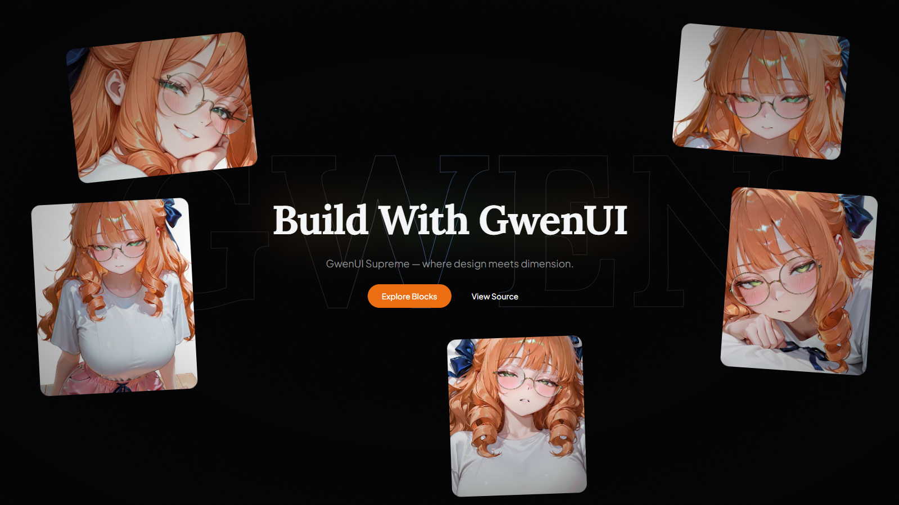

# GwenUI Supreme — Parallax Hero

An ultra-premium, interactive 3D spring-physics parallax hero block styled with a cinematic dark aesthetic, thinned spotlight vector hover backdrop, and a glowing gradient ambient shadow header. Built for high performance and visual excellence.



---

### 🔗 Live Blocks Documentation: [gwenui.vercel.app](https://gwenui.vercel.app)

---

## ✨ Key Features & Architecture

The hero layout utilizes a high-fidelity **Absolute Depth Layer Stack** designed to capture mouse coordinates and transform them into gorgeous, fluid depth motions:

```
┌────────────────────────────────────────────────────────┐
│  z-10  Center content (Headline, Desc, CTA Buttons)    │
│  z-5   Floating Depth Cards (5 optimized WebP layers)  │
│  z-0   "GWEN" Interactive SVG spotlight backdrop       │
│  bg    Cinematic solid dark backdrop                   │
└────────────────────────────────────────────────────────┘
```

1. **Center Content & Ambient Backlight Glow (`z-10`):**
   * Crisp foreground title styled with **Lora serif font** backed by a blurred, colorful neon drop-shadow projection (**Gwen Peach Red** to **Teal/Cyan**) that simulates dynamic light passing through the letters.
   * Description and CTA buttons styled with **Plus Jakarta Sans font**.
   * Strategic pointer-events routing: the content container ignores mouse clicks (`pointer-events-none`) so hover coordinates pass seamlessly to the background, while the CTA buttons explicitly re-enable interaction.

2. **3D Spring Mouse Parallax Cards (`z-5`):**
   * Five high-fidelity anime character cards floating in space, reacting to cursor movement with natural inertial physics using Framer Motion's `useSpring` hook.
   * **Lossless Rendering Optimization:** Bypasses Next.js default downscaling by using raw standard `` tags, maintaining absolute color vibrancy and sharp borders on all devices.

3. **Thinned Interactive Spotlight Vector (`z-0`):**
   * A massive interactive SVG spotlight backdrop spelling out **"GWEN"** that tracks the cursor position.
   * Outlines are styled with a delicate thinned border (`strokeWidth="0.1"`) to maintain an extremely premium, sophisticated design system feel.

---

## 🛠️ Tech Stack

* **Framework:** Next.js 14 App Router (React 18)
* **Language:** TypeScript (100% strict type-safe, verified zero compiler errors)
* **Styling:** Tailwind CSS v4.0 (utilizing custom variables & OKLCH color spaces)
* **Animation:** Framer Motion (for spring inertia and outline drawing)
* **Components:** shadcn/ui (Button)
* **Assets:** Next-gen **WebP** image format (reduced total asset weight from **6.43 MB** to just **598 KB** — a **90% compression optimization** without loss of clarity).

---

## 🚀 Getting Started

### 1. Installation
Clone the repository and install the pruned, lightweight dependencies (fully cleaned of unneeded R3F / Three.js overhead):

```bash
# Install dependencies
pnpm install
```

### 2. Run the Development Server
Launch the development environment (compiles in under 60ms!):

```bash
pnpm dev
```

Open [http://localhost:3000](http://localhost:3000) with your browser to experience the parallax motion!

### 3. Build & Deploy (Vercel Ready)
Compile a production-optimized build:

```bash
pnpm build
```

This project compiles flawlessly and is pre-configured for instant deployment on the Vercel Platform.

---

## 📦 Component Usage & Props

To integrate the `ParallaxHero` block into any page:

```tsx
import { ParallaxHero, defaultLayers } from "@/src/components/blocks/supreme/parallax-hero";

export default function Home() {
  return (
    <ParallaxHero
      headline="Build something extraordinary."
      description="GwenUI Supreme — where design meets dimension."
      primaryCta="Explore Blocks"
      secondaryCta="View Source"
      bgText="GWEN"
      layers={defaultLayers}
      onPrimaryClick={() => console.log("Primary clicked")}
      onSecondaryClick={() => console.log("Secondary clicked")}
    />
  );
}
```

### Properties
| Prop | Type | Description |
| :--- | :--- | :--- |
| `headline` | `string` | The main hero title (renders with Lora Serif and a glowing backlight shadow). |
| `description` | `string` (Optional) | The description paragraph located under the title. |
| `primaryCta` | `string` | The label text for the primary button. |
| `secondaryCta` | `string` | The label text for the secondary outline button. |
| `bgText` | `string` | The massive word rendered as the interactive SVG backdrop. |
| `layers` | `ParallaxImageLayer[]` | Configuration array specifying the position, depth, rotation, and WebP sources of the floating cards. |
| `onPrimaryClick` | `() => void` | Click event handler for the primary CTA button. |
| `onSecondaryClick` | `() => void` | Click event handler for the secondary CTA button. |

---

## 💎 Performance & Quality Standards

* **Zero Layout Shifts (CLS):** Fully optimized image cards pre-seeded with absolute dimensions.
* **Lightweight Bundle:** 100% of unused Three.js and `@react-three` packages have been uninstalled, reducing main bundle overhead by multiple megabytes.
* **Typographic Harmony:** Explicit global variables mapping Lora (Headline/Backdrop) and Plus Jakarta Sans (UI elements) to ensure consistent, elegant brand presence.

---

## 📄 License

This project is licensed under the **Elastic License 2.0 (ELv2)**. See the [LICENSE](./LICENSE) file for the full license terms.

Copyright (c) 2026, **JinXSuper Developer**.

